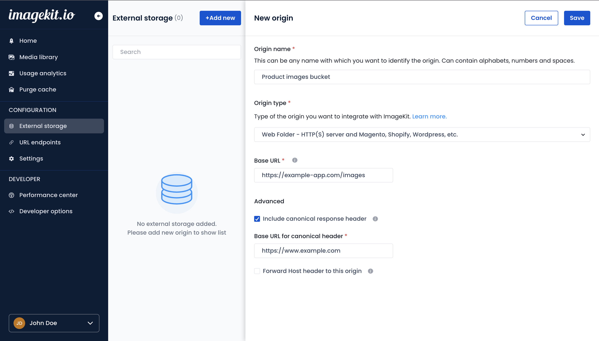

# Web server

Any web server which is accessible over HTTP or HTTPS can be configured as an origin in ImageKit.io. This allows you to use ImageKit.io's real-time image optimization and transformation features on all existing images.

**Note:** We do not start copying images from your server as soon as you add it. Instead, we will fetch the particular image when you request it through ImageKit.io URL-endpoint. [Learn more](../how-it-works.md) to understand how this works. The images accessed from this origin will not appear in your [Media library](../../media-library/overview/).

## Step 1: Configure origin

1. Go to the [external storage section](https://imagekit.io/dashboard#external-storage) in your ImageKit.io dashboard, and under the Origins section, click on the "Add origin" button.
2. Choose **Web server** from the origin type dropdown.
3. Give your origin a name, it will appear in the list of origins you have added. For example - **Website load balancer**.
4. Fill out the base URL, for example, if your current image URL is `https://www.example.com/rest-of-the-path.jpg`, then enter `https://www.example.com` as the base URL.
5. Leave the [advanced options](web-server-origin.md#advanced-options-for-web-server-origin) as it is for now.
6. Click on Submit button.


:man_mage:**Whitelist request from ImageKit.io**\
****Make sure that your web-server is accessible from ImageKit.io. [Learn more](web-server-origin.md#whitelist-request-from-imagekit-io).


## Step 2: Access the image through ImageKit.io URL-endpoint

When you add your first origin in the dashboard, the origin is by default made accessible through the [default URL-endpoint](../url-endpoints.md#default-url-endpoint) of your ImageKit.io account. For subsequent origins, you can either create a separate URL-endpoint or edit existing URL-endpoint (including default) and make this newly added origin accessible by editing the [origin preference list](../url-endpoints.md#image-origin-preference). 

Let's look at a few examples to fetch the images:

* **Original image through your web server (old URL)**\
  ****[https://www.example.com/rest-of-the-path.jpg](https://www.example.com/rest-of-the-path.jpg)
* **The same master image using ImageKit.io URL-endpoint**\
  ****[https://ik.imagekit.io/your_imagekit_id/rest-of-the-path.jpg](https://ik.imagekit.io/your_imagekit_id/rest-of-the-path.jpg)
* **Resized 300x300 image**\
  ****[https://ik.imagekit.io/your_imagekit_id/`tr:w-300,h-300`/rest-of-the-path.jpg](https://ik.imagekit.io/your_imagekit_id/tr:w-300,h-300/rest-of-the-path.jpg)

So when you request `https://ik.imagekit.io/your_imagekit_id/rest-of-the-path.jpg`, ImageKit.io internally fetches the file from `https://www.example.com/rest-of-the-path.jpg`.



```markup
            URL-endpoint                transformation      image path                                    
┌─────────────────────────────────────┐┌─────────────┐┌───────────────────┐
https://ik.imagekit.io/your_imagekit_id/tr:w-300,h-300/rest-of-the-path.jpg
```



If you get a "Not found" error while accessing the image, check out this [troubleshooting guide](../../limits-and-troubleshooting/404-not-found-error-troubleshooting.md).


:man_mage:**Tips:** You can also use a [custom domain](../../testing-and-infrastructure-setup/using-custom-domain-name.md) like images.example.com.


## Step 3: Integrate and Go live

Now start using ImageKit.io URL endpoint in your application to accelerate image loading.

**Get started with our quick start guides and SDKs:**


[quickstart-guides](../../getting-started/quickstart-guides/)



[sdk.md](../../api-reference/api-introduction/sdk.md)


**Learn about real-time image resizing:**


[image-transformations](../../features/image-transformations/)


## Advanced options for web server origin

### Include canonical response header

When enabled, the image response contains a Link header with the appropriate URL and rel=canonical. You will have to specify the base URL for the canonical header.



For example, if you set `https://www.example.com` as the base URL for canonical header, then the image response for URL `https://ik.imagekit.io/your_imagekit_id/rest-of-the-path.jpg` will have a Link header like this:

```http
Link: <https://www.example.com/rest-of-the-path.jpg>; rel="canonical"
```

### Forward Host header to this origin

By default, when ImageKit.io tries to get the image from your origin, the value of the Host header is the same as the base URL specified for the origin. For example, if the base URL is [https://www.example.com](https://www.example.com), then the same gets forward to your origin.

However, when this setting is enabled, the host value from the image URL will be forwarded to the origin as the Host header. For example, if you are using a custom domain name for your image URLs, like `static.example.com` , then that is what gets forwarded to your host instead of `www.example.com`

## Whitelist request from ImageKit.io

If you have deployed a WAF, you need to whitelist requests coming from ImageKit.io servers.

We recommend you to whitelist our requests to your origin based on request header value. All our requests to your origin will have a header `x-req-from` with its value set to `imagekit`.

Below is a list of IP addresses currently used by ImageKit.io to fetch images from your origin:


Note that these IP addresses are subject to change in the future. Any changes will be reflected and updated in this document.


```
3.0.152.204
3.105.141.56
3.105.153.182
3.105.56.110
3.106.43.145
3.120.113.108
3.124.164.235
3.125.145.160
3.125.232.112
3.126.54.34
3.228.64.190
3.25.15.199
3.6.106.236
3.6.117.197
3.6.117.226
3.6.125.142
3.6.139.207
3.6.31.234
3.6.77.26
13.211.250.60
13.234.210.223
13.235.117.100
13.239.68.153
13.239.93.60
13.250.152.216
13.251.231.118
13.54.10.227
13.57.157.178
13.57.80.35
13.57.84.219
15.206.35.88
18.136.180.238
18.138.42.101
18.138.48.167
18.140.193.132
18.144.94.93
18.184.51.46
18.194.51.214
18.214.253.69
34.198.33.10
34.227.255.75
35.156.190.52
52.1.78.96
52.220.21.200
52.221.19.26
52.23.130.57
52.29.99.236
52.52.150.88
52.52.156.33
52.53.89.205
52.63.6.226
52.76.146.253
52.86.168.184
52.9.51.127
52.9.54.118
54.183.110.13
54.198.229.74
54.93.187.13
100.25.189.19
100.26.0.170
18.138.154.61
52.66.188.11
3.123.46.194
3.226.115.3
13.52.20.231
3.24.91.28
159.65.154.196
206.189.46.125
174.138.126.207
142.93.174.223
34.228.164.220
18.156.150.128
3.123.211.55
3.126.236.57
3.126.25.38
3.66.248.204
3.74.172.234
3.76.53.155
3.77.243.243
3.77.50.194
54.151.133.111
52.74.122.107
18.138.154.61
3.1.207.90
52.77.198.19
18.136.88.63
18.138.189.41
13.215.97.100
13.228.210.47
13.228.217.227
13.250.195.31
13.251.132.82
18.138.97.218
3.1.46.98
52.220.37.193
52.76.110.156
54.169.79.116
100.24.177.67
18.214.141.92
50.17.57.46
52.45.208.226
54.145.114.168
54.237.174.138
43.204.172.86
3.108.149.71
65.1.72.129
43.205.66.219
13.234.247.83
15.206.97.20
13.233.234.115
13.234.159.248
```
