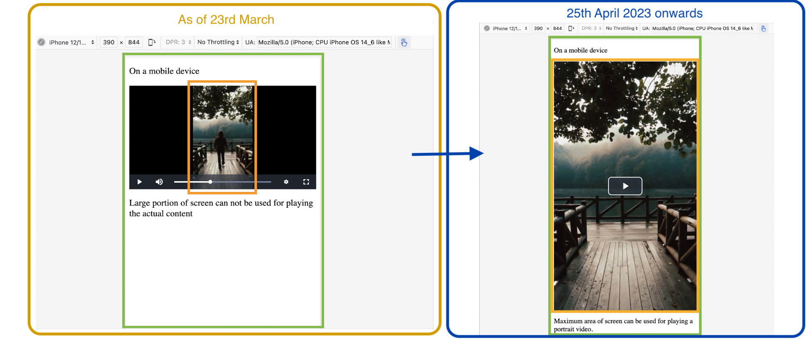

# Modifications in the resizing method for ABS representations


All ABS representations created after 25th April, 2023 will use [at_max cropping strategy](../features/video-transformation/resize-crop-and-other-common-video-transformations.md#max-size-cropping-strategy---c-at_max) to resize the representations instead of current [pad_resize crop mode](../features/video-transformation/resize-crop-and-other-common-video-transformations.md#pad-resize-crop-strategy---cm-pad_resize).


As of 23 March 2023, Imagekit resizes the ABS representations using [pad_resize crop mode](../features/video-transformation/resize-crop-and-other-common-video-transformations.md#pad-resize-crop-strategy---cm-pad_resize), to a strict aspect ratio of 16:9 for all the resolutions. This adds black color padding for inputs that don't have aspect ratio of 16:9.

For playlist URL <https://ik.imagekit.io/demo/sample-portrait.mp4/ik-master.m3u8?tr=sr-240_360_480_720> as of 23 March 2023:


After the planned modifications on 25th April 2023, Imagekit will use [at_max cropping strategy](../features/video-transformation/resize-crop-and-other-common-video-transformations.md#max-size-cropping-strategy---c-at_max) to resize the representations. This will preserve the original aspect ratio of input and not add padding to the output.

For playlist URL <https://ik.imagekit.io/demo/sample-portrait.mp4/ik-master.m3u8?tr=sr-240_360_480_720> after modifications:


## Why is this behavior changing?

Adding black padding to the output restricted the experience of portrait videos on portrait screens.

Mobile devices in portrait mode would not utilize their entire screen area efficiently, as the 16:9 ratio will restrict the player to a small portion of the screen & the black padding further reduces the size of the actual video content being rendered.



## Handling this change

So far, Imagekit’s ABS has ensured that the output always has an aspect ratio of 16:9, irrespective of the input’s dimensions. In case you have designed your user interface such that it relies on the dimension of the output video content, then you will have to make changes so that the user interface is not dependent on the final output dimension. Once this change is live, the output will have the aspect ratio of the input video.

### With video.js

If you want to preserve the 16:9 aspect ratio of the play, you can consider using the aspect-ratio setting in the video.js layout options.

```javascript
videojs('my-player', {
    controls: true,
    aspectRatio: "16:9" // Set aspect ratio that suits your UI
});
```

[Learn more in video.js docs](https://videojs.com/guides/layout/#setting-aspect-ratio)
